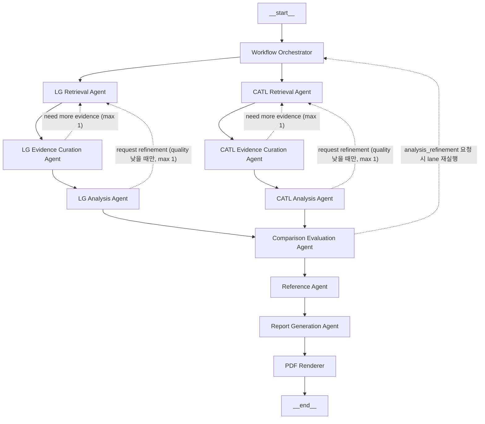

# Battery Agent 발표용 개요

## 1. Overview
- 목적: LG에너지솔루션과 CATL의 배터리 시장 전략을 비교 분석하고, 근거 기반 최종 보고서(Markdown/PDF)를 생성한다.
- 입력: 로컬 PDF 코퍼스(Chroma), 웹 검색 결과(Tavily), 실행 환경 변수(.env).
- 출력: 회사별 검색/큐레이션/분석 산출물, 비교 결과, 참고문헌, 최종 보고서.

## 2. Features
- PDF 기반 Agentic RAG: PDF -> chunking -> embedding(Qwen) -> Chroma 적재/검색.
- 웹 검색 보강: Tavily 기반 검색, 출처 편중 제한, LG/CATL 호출량 균등 분배.
- 회사별 독립 파이프라인: Retrieval -> Evidence Curation -> Analysis.
- 비교/보고서 자동화: Comparison -> Reference -> Report Generation -> PDF.
- 근거 품질 관리: 참조 생성 시 품질 점수 기반 정렬/필터링.
- 재실행 루프: `need more evidence`, `request refinement` 자동 재시도(완화 기준 + 최대 재시도 제한).
- 보고서 품질 강화: 표로 구조화 가능한 항목은 Markdown 표 중심으로 생성.

## 3. Tech Stack
- Language: Python 3.11+
- LLM: OpenAI Structured Output (`gpt-4o-mini` 기본)
- Embedding: `Qwen/Qwen3-Embedding-0.6B`
- Vector DB: Chroma
- Web Search: Tavily
- PDF Parsing: pypdf
- PDF Rendering: markdown + weasyprint
- Test: unittest
- Env/Package: `.env`, `uv`, `pyproject.toml`

## 4. Agents 목록 및 구현 내용
- LG Retrieval Agent
  - 로컬 검색 + 웹 검색 결합, 쿼리 확장 적용.
- LG Evidence Curation Agent
  - 중복 제거, 토픽 버킷 구성, 분석 가능 상태 판정.
- LG Analysis Agent
  - 구조화 출력(JSON) 기반 전략/강점/리스크/지표 생성.
- CATL Retrieval Agent
  - LG와 동일 패턴, 회사 분리 컨텍스트로 실행.
- CATL Evidence Curation Agent
  - CATL 전용 근거 큐레이션.
- CATL Analysis Agent
  - CATL 전용 분석 결과 생성.
- Comparison Evaluation Agent
  - 양사 결과 정규화, 전략 차이/강약점/SWOT/인사이트/지표 통합.
- Reference Agent
  - 실제 사용 citation 기준 참고문헌 생성, 품질 점수 기반 정렬.
- Report Generation Agent
  - 한국어 최종 보고서 생성, 표 중심 형식화, 섹션별 상세화.
- PDF Renderer
  - Markdown -> PDF 변환.

## 5. Pattern(Distributed) 적용
- 적용 방식: 회사별 lane을 분리한 Distributed Workflow + 중앙 Orchestrator 제어.
- 해석 기준: 완전 탈중앙(Fully Distributed)은 아니고, `분산 실행 + 중앙 코디네이션` 구조.
- Lane 구조:
  - `LG Retrieval -> LG Curation -> LG Analysis`
  - `CATL Retrieval -> CATL Curation -> CATL Analysis`
- 합류 구조:
  - `Comparison -> Reference -> Report -> PDF`
- 보강:
  - `need more evidence`와 `request refinement` 루프를 자동 재실행으로 구현.
  - 단, 과도 반복 방지를 위해 완화 기준(품질 점수/재시도 제한) 적용.

## 6. 아키텍처


## 7. 디렉토리 구조(간략)
```text
battery-agent/
  src/battery_agent/
    agents/        # retrieval/curation/analysis/comparison/reference/report
    pipeline/      # orchestrator, workflow_state, handoffs
    rag/           # pdf ingest, chunker, embedder, chroma
    search/        # local/chroma retriever, tavily web search
    reporting/     # markdown/pdf renderer
    models/        # data models
    cli.py
  corpus/          # 회사별 PDF 코퍼스
  artifacts/       # 실행 산출물
  tests/           # unittest
  README.md
  read.md
```

## 8. 실행 방법
1. 환경 준비
```bash
uv venv .venv
uv pip install --python .venv/bin/python -e .
```

2. 환경 변수 설정 (`.env`)
```dotenv
OPENAI_API_KEY=...
TAVILY_API_KEY=...
BATTERY_AGENT_WEB_SEARCH=true
```

3. PDF 임베딩 적재
```bash
PYTHONPATH=src .venv/bin/python -m battery_agent.cli ingest-pdfs
```

4. 통합 분석 실행
```bash
PYTHONPATH=src .venv/bin/python -m battery_agent.cli --run-id manual-run
```

5. 결과 확인
- `artifacts/<run-id>/reports/final_report.md`
- `artifacts/<run-id>/reports/final_report.pdf`

## 9. 초기 설계 대비 구조 변경 사항
- Supervisor/계층형 중심 구상 -> 회사 lane 분리 중심 Distributed + 중앙 Orchestrator 구조로 정리.
- 단순 1회 파이프라인 -> 증거 부족/정제 요청 자동 재실행 루프 추가.
- 웹 검색 호출 편향 이슈 -> LG/CATL 웹 검색 호출량 균등 분배로 수정.
- 정성 위주 보고서 -> 표 중심 보고서 생성 프롬프트 강화.
- 참고문헌 생성 -> 근거 품질 점수 기반 정렬/필터링 로직 추가.
