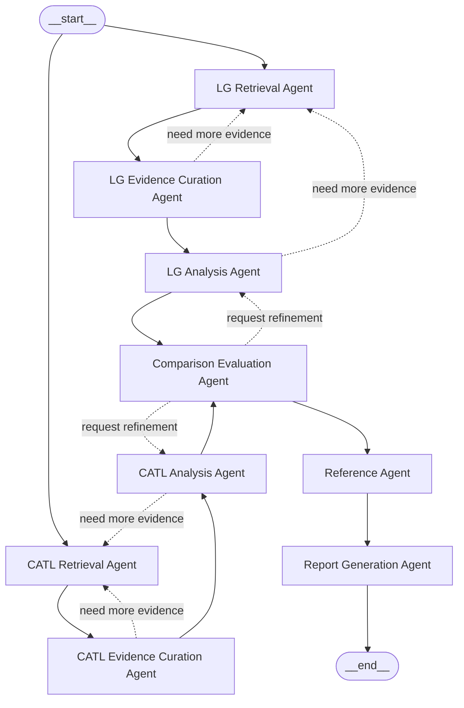

# Distributed Agent Architecture Design

## Goal

`LG에너지솔루션`과 `CATL` 비교 분석 서비스를 `distributed agent graph` 구조로 고정한다.  
중앙 supervisor agent 없이 각 agent가 자신의 책임 범위에서 입력을 처리하고, `도구 사용`, `재시도`, `부분 종료`, `다음 단계 handoff`를 부분적으로 판단하도록 설계한다.

## Design Decision

이 프로젝트는 아래 구조를 사용한다.

- 중앙 `Supervisor Agent`는 두지 않는다.
- LG 라인과 CATL 라인은 각각 독립된 distributed lane으로 동작한다.
- 각 lane은 `Retrieval -> Evidence Curation -> Analysis` 순서로 진행된다.
- 각 agent는 자기 역할 범위 안에서 다음 행동을 결정한다.
- 두 기업 분석 결과가 모두 준비되면 `Comparison Evaluation Agent`가 실행된다.
- 실제 사용 근거가 정리되면 `Reference Agent`가 실행된다.
- 비교 결과와 참고문헌이 준비되면 `Report Generation Agent`가 실행된다.
- 실행 런타임은 state 전달과 그래프 실행만 담당하며, 판단 주체가 아니다.

## Why This Structure

이 구조를 선택한 이유는 다음과 같다.

- 기존 hierarchical supervisor 구조는 제어 노드가 많아 시각적, 개념적 복잡도가 높았다.
- 현재 과제는 회사별 분석 라인이 명확하게 분리되어 있어 distributed lane 구조로 표현하기 쉽다.
- retrieval, curation, analysis, comparison, reference, report의 책임 경계를 그대로 유지하면서 중앙 agent를 제거할 수 있다.
- 재시도와 보완 요청을 각 agent 내부 판단으로 옮기면 중앙 제어 복잡도를 더 줄일 수 있다.

## Distributed Graph



## Agent Graph

```text
START
|- LG Retrieval Agent
|  `- LG Evidence Curation Agent
|     `- LG Analysis Agent
|- CATL Retrieval Agent
|  `- CATL Evidence Curation Agent
|     `- CATL Analysis Agent
`- Comparison Evaluation Agent
   `- Reference Agent
      `- Report Generation Agent
```

## Responsibility Matrix

| Agent | Primary Role | Input | Output | Does Not Decide |
|---|---|---|---|---|
| `LG Retrieval Agent` | LG 자료 검색 | LG 질의, 로컬 코퍼스, 제한적 웹 검색 설정 | LG 검색 결과, 문서 식별자, 검색 로그, `next_action` | CATL 분석 내용 |
| `LG Evidence Curation Agent` | LG 근거 정리 | LG 검색 결과 | 중복 제거된 LG 근거 묶음, 주제 분류 결과, `next_action` | LG/CATL 비교 결론 |
| `LG Analysis Agent` | LG 전략 분석 | LG 근거 묶음 | LG 전략/경쟁력/리스크 분석 결과, `next_action` | CATL 상대 평가 |
| `CATL Retrieval Agent` | CATL 자료 검색 | CATL 질의, 로컬 코퍼스, 제한적 웹 검색 설정 | CATL 검색 결과, 문서 식별자, 검색 로그, `next_action` | LG 분석 내용 |
| `CATL Evidence Curation Agent` | CATL 근거 정리 | CATL 검색 결과 | 중복 제거된 CATL 근거 묶음, 주제 분류 결과, `next_action` | LG/CATL 비교 결론 |
| `CATL Analysis Agent` | CATL 전략 분석 | CATL 근거 묶음 | CATL 전략/경쟁력/리스크 분석 결과, `next_action` | LG 상대 평가 |
| `Comparison Evaluation Agent` | 기업 간 비교 평가 | LG 분석 결과, CATL 분석 결과 | 전략 차이, 강약점, SWOT, 종합 시사점, `next_action` | retrieval 재실행의 구체적 방법 |
| `Reference Agent` | 최종 참고문헌 생성 | 실제 사용된 근거 목록 | `REFERENCE` 섹션용 참고문헌 목록 | 보고서 본문 결론 수정 |
| `Report Generation Agent` | 최종 Markdown 보고서 조립 | 비교 결과, 시사점, 참고문헌, 필수 섹션 규칙 | 최종 Markdown 보고서 | 검색 단계 재실행 |

## Allowed and Forbidden Context

| Agent | Allowed Context | Forbidden Context |
|---|---|---|
| `LG Retrieval Agent` | LG 기업명, LG 관련 질의, 로컬 코퍼스, 제한적 웹 검색 설정, 검색 정책, 페이지 제한 규칙 | CATL 검색 질의, CATL 분석 결과, LG/CATL 비교 기준, SWOT 결과, 보고서 목차 |
| `LG Evidence Curation Agent` | LG 검색 결과, LG 문서 식별자, LG 근거 신뢰도 규칙, 중복 제거 규칙, LG 주제 분류 규칙 | CATL 근거 묶음, 비교 결과, 최종 보고서 문체 규칙 |
| `LG Analysis Agent` | LG 근거 묶음, LG 전략 분석 프롬프트, LG 경쟁력/리스크 정리 규칙, 근거 인용 규칙 | CATL 근거, CATL 전략 요약, 두 기업 비교 요청, SWOT 생성 요청, 참고문헌 포맷 규칙 |
| `CATL Retrieval Agent` | CATL 기업명, CATL 관련 질의, 로컬 코퍼스, 제한적 웹 검색 설정, 검색 정책, 페이지 제한 규칙 | LG 검색 질의, LG 분석 결과, LG/CATL 비교 기준, SWOT 결과, 보고서 목차 |
| `CATL Evidence Curation Agent` | CATL 검색 결과, CATL 문서 식별자, CATL 근거 신뢰도 규칙, 중복 제거 규칙, CATL 주제 분류 규칙 | LG 근거 묶음, 비교 결과, 최종 보고서 문체 규칙 |
| `CATL Analysis Agent` | CATL 근거 묶음, CATL 전략 분석 프롬프트, CATL 경쟁력/리스크 정리 규칙, 근거 인용 규칙 | LG 근거, LG 전략 요약, 두 기업 비교 요청, SWOT 생성 요청, 참고문헌 포맷 규칙 |
| `Comparison Evaluation Agent` | LG 분석 결과, CATL 분석 결과, 비교 프레임, SWOT 규칙, 종합 시사점 규칙 | 원시 검색 로그 전체, 미정제 코퍼스 전체, 회사별 재검색 제어권, 보고서 최종 렌더링 규칙 |
| `Reference Agent` | 실제 사용된 근거 목록, 출처 메타데이터, 참고문헌 포맷 규칙, 자료 유형 분류 규칙 | 사용되지 않은 후보 전체, 비교 결론 수정 권한, 보고서 본문 생성 책임 |
| `Report Generation Agent` | 비교 결과, SWOT, 종합 시사점, 참고문헌 목록, 보고서 목차 규칙, `SUMMARY/REFERENCE` 규칙, 부분 보고서 표시 규칙 | 원시 retrieval 결과, 미정제 evidence 목록, 재검색 판단 권한, 회사별 분석 재해석 권한 |

### Context Boundary Rules

1. `Retrieval Agent`는 검색만 수행하고 해석 결론을 만들지 않는다.
2. `Evidence Curation Agent`는 정리와 필터링만 수행하고 비교 평가를 하지 않는다.
3. `Analysis Agent`는 자기 회사만 분석하고 상대 회사를 직접 비교하지 않는다.
4. `Comparison Evaluation Agent`만 두 회사 결과를 동시에 본다.
5. `Report Generation Agent`는 확정된 결과만 조립하고 상위 단계 판단을 덮어쓰지 않는다.

## Shared Workflow State

중앙 supervisor 대신 아래 state를 공유한다.

- `workflow_state`
  실행 ID, 주제, 코퍼스 정보, 웹 검색 허용 여부, 최종 상태, next_handoff

- `lg_lane_state`
  retrieval 결과, curated evidence, analysis 결과, retry 횟수, partial 여부, last_action

- `catl_lane_state`
  retrieval 결과, curated evidence, analysis 결과, retry 횟수, partial 여부, last_action

- `comparison_state`
  comparison 결과, SWOT 결과, 종합 시사점, used_sources, refinement_requests

- `report_state`
  references, summary availability, markdown availability, pdf availability

## Agent-Local Decision Rules

### LG Retrieval Agent

- 로컬 검색 결과가 부족하면 질의를 재작성한다.
- 질의 재작성 후에도 부족하면 제한적 웹 검색을 수행한다.
- 근거가 충분하면 `LG Evidence Curation Agent`로 handoff한다.
- 재시도 한도를 초과하면 `partial` 상태로 종료한다.

### LG Evidence Curation Agent

- 중복 제거와 분류 후 근거 품질이 부족하면 `LG Retrieval Agent`로 보완 요청을 보낸다.
- 분석 가능한 상태가 되면 `LG Analysis Agent`로 handoff한다.

### LG Analysis Agent

- 분석 중 근거 부족이 확인되면 `LG Retrieval Agent`로 보완 요청을 보낸다.
- 분석이 완료되면 LG lane을 완료 상태로 기록한다.

### CATL Retrieval Agent / CATL Evidence Curation Agent / CATL Analysis Agent

- LG 라인과 동일한 규칙으로 동작한다.

### Comparison Evaluation Agent

- 양사 분석 결과가 모두 준비되면 비교를 수행한다.
- 비교 과정에서 특정 기업 분석이 약하면 해당 기업의 `Analysis Agent`에 보완 요청을 보낼 수 있다.
- 비교 결과가 정리되면 `Reference Agent`로 handoff한다.

### Reference Agent

- 실제 사용 근거를 포맷팅한 뒤 `Report Generation Agent`로 handoff한다.

### Report Generation Agent

- 비교 결과와 참고문헌이 충분하면 최종 Markdown을 생성한다.
- 일부 정보가 부족하면 부분 보고서로 종료한다.

## Retry Ownership

재시도 책임은 아래처럼 분산한다.

- `LG Retrieval Agent`
  LG 재검색, 질의 재작성, 제한적 웹 검색 전환

- `CATL Retrieval Agent`
  CATL 재검색, 질의 재작성, 제한적 웹 검색 전환

- `LG Analysis Agent`
  LG 부분 분석 판정과 제한 상태 표기

- `CATL Analysis Agent`
  CATL 부분 분석 판정과 제한 상태 표기

- `Comparison Evaluation Agent`
  양사 분석 결과 부족 시 비교 결과를 제한 상태로 기록

## Failure Policy

### Partial Success

아래 상황에서는 부분 성공으로 처리한다.

- 한 회사 또는 양 회사에서 일부 섹션의 근거가 부족하지만 최소 분석 결과는 생성 가능하다.
- 비교 결과는 생성 가능하나 일부 시사점은 제한적으로만 진술할 수 있다.
- 참고문헌과 SUMMARY를 포함한 보고서 생성은 가능하다.

### Global Failure

아래 상황에서는 전체 실패로 처리한다.

- `SUMMARY` 생성에 필요한 핵심 결과가 없다.
- `REFERENCE`를 생성할 수 없다.
- 두 회사 비교의 중심 근거가 전반적으로 붕괴해서 비교 자체가 불가능하다.

## Implementation Mapping

이 설계는 다음 구현 구조와 연결된다.

- `src/battery_agent/pipeline/workflow_state.py`
  공유 workflow state 정의

- `src/battery_agent/pipeline/handoffs.py`
  handoff 계약과 다음 단계 판단 규칙

- `src/battery_agent/agents/lg_*.py`
  LG distributed lane worker agents

- `src/battery_agent/agents/catl_*.py`
  CATL distributed lane worker agents

- `src/battery_agent/agents/comparison.py`
  비교 평가

- `src/battery_agent/agents/references.py`
  참고문헌 생성

- `src/battery_agent/agents/report_generation.py`
  보고서 생성

- `src/battery_agent/pipeline/orchestrator.py`
  agent graph 실행과 state 전달

## Recommended Next Steps

1. `service-definition.md`를 distributed pattern 기준으로 맞춘다.
2. 제출용 보고서 초안의 그래프와 state 설명을 distributed 구조로 교체한다.
3. implementation plan에서 supervisor 관련 파일과 task를 workflow state/handoff task로 바꾼다.
4. 상태 전이도와 agent별 I/O 스키마를 기준으로 orchestrator 설계를 시작한다.
