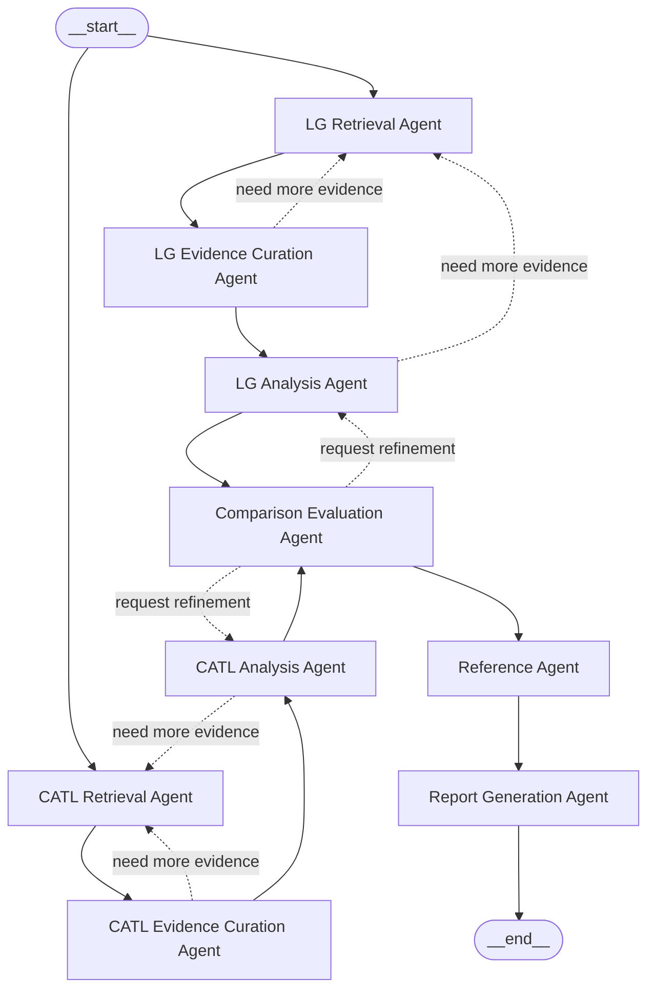

# 배터리 시장 전략 분석 Agent 시스템 설계 보고서 초안

## 1. 프로젝트 개요

본 프로젝트는 `LG에너지솔루션`과 `CATL`의 포트폴리오 다각화 전략을 비교 분석하고, 그 결과를 바탕으로 최종 전략 분석 보고서를 자동 생성하는 `CLI 기반 전용 서비스`를 설계하는 것을 목표로 한다.

본 시스템은 범용 기업 비교 플랫폼이 아니라, 과제 수행을 위한 비교 분석 서비스로 한정한다. 따라서 입력 다양성보다 `재현성`, `안정성`, `근거 기반 분석`, `자동화 수준`을 우선한다.

최종 산출물은 다음과 같다.

| 구분 | 내용 |
|---|---|
| 최종 보고서 | 한국어 `Markdown` 형식 보고서 |
| 최종 보고서 | `PDF` 형식 보고서 |
| 중간 산출물 | 검색 로그, 근거 정리 파일, 기업별 분석 결과, 비교 분석 결과 |
| 운영 기록 | 참고문헌 목록, 실행 로그, 재시도 로그 |

---

## 2. Workflow 설계

### 2.1 Goal

본 시스템의 목표는 `LG에너지솔루션`과 `CATL`의 포트폴리오 다각화 전략을 비교 분석한 최종 보고서를 자동 생성하는 것이다.

구체적으로 시스템은 다음을 수행해야 한다.

| 항목 | 설명 |
|---|---|
| 근거 수집 | 배터리 시장 환경 변화와 관련된 근거 자료 수집 |
| 기업 분석 | 두 기업의 포트폴리오 다각화 전략 및 핵심 경쟁력 정리 |
| 비교 평가 | 두 기업의 전략 차이점과 강약점 비교 |
| 종합 분석 | SWOT 분석 및 종합 시사점 도출 |
| 보고서 생성 | 최종 보고서의 `Markdown` 및 `PDF` 자동 생성 |

### 2.2 Criteria

본 시스템은 아래 기준을 만족해야 한다.

| 기준 | 설명 |
|---|---|
| 비교 중심성 | 보고서는 `LG에너지솔루션`과 `CATL` 비교를 중심으로 구성되어야 한다. |
| 근거 기반성 | 분석 내용은 데이터 및 근거 기반으로 작성되어야 한다. |
| 언어 일관성 | 보고서는 한국어로 일관되게 작성되어야 한다. |
| 산출물 형식 | 최종 결과물은 `Markdown`과 `PDF` 두 형식으로 생성되어야 한다. |
| 참고문헌 정확성 | 참고문헌은 실제 사용한 자료만 포함해야 한다. |
| 재현성 | 동일한 로컬 코퍼스 기준에서 재현 가능한 결과를 생성해야 한다. |
| 안정성 | 일부 단계 실패 시 제한된 재시도 후 가능한 범위의 부분 보고서를 생성할 수 있어야 한다. |

### 2.3 Task

시스템의 주요 작업은 다음과 같이 정의한다.

| 순서 | Task |
|---|---|
| 1 | LG 관련 자료 수집 |
| 2 | LG 근거 정리 |
| 3 | LG 전략 분석 |
| 4 | CATL 관련 자료 수집 |
| 5 | CATL 근거 정리 |
| 6 | CATL 전략 분석 |
| 7 | 두 기업 비교 평가 |
| 8 | SWOT 분석 |
| 9 | 종합 시사점 도출 |
| 10 | 참고문헌 생성 |
| 11 | 최종 Markdown/PDF 보고서 생성 |

### 2.4 Control Strategy

본 시스템은 `Distributed pattern` 기반의 통제 전략을 사용한다.

| 항목 | 내용 |
|---|---|
| 구조 원칙 | 중앙 `Supervisor Agent` 없이 agent들이 공유 workflow state와 handoff 계약을 기준으로 동작한다. |
| 회사별 독립성 | LG 라인과 CATL 라인은 각각 독립된 distributed lane으로 동작한다. |
| 단계 전환 | agent가 자신의 출력으로 `다음 단계 handoff`를 직접 결정한다. |
| 재시도 | 근거가 부족한 경우 해당 retrieval, curation, analysis agent가 자기 범위 안에서 제한된 재시도 또는 보완 요청을 수행한다. |
| 부분 결과 처리 | 재시도 후에도 근거가 불충분하면 `제한된 분석` 상태를 명시하고 부분 보고서를 생성한다. |

### 2.5 Structure

본 시스템의 구조는 아래와 같다.

| 계층 | 구성 |
|---|---|
| 시작 계층 | workflow 시작 노드 |
| 회사별 분석 계층 | LG worker lane, CATL worker lane |
| 통합 계층 | 비교 및 산출물 생성 agent |
| 실행 지원 계층 | workflow runtime과 shared state |

즉, 회사별로 `수집 -> 근거 정리 -> 분석` 흐름을 독립적으로 수행한 뒤, 두 결과가 모두 준비되면 비교 분석과 보고서 생성 단계로 진입한다.

---

## 3. Workflow에서 Agent로의 매핑

### 3.1 전체 에이전트 구성

본 시스템은 아래 agent들로 구성된다.

| 계층 | Agent |
|---|---|
| LG Worker | `LG Retrieval Agent` |
| LG Worker | `LG Evidence Curation Agent` |
| LG Worker | `LG Analysis Agent` |
| CATL Worker | `CATL Retrieval Agent` |
| CATL Worker | `CATL Evidence Curation Agent` |
| CATL Worker | `CATL Analysis Agent` |
| Integration | `Comparison Evaluation Agent` |
| Integration | `Reference Agent` |
| Integration | `Report Generation Agent` |

### 3.2 Agent 정의

| Agent 유형 | 주요 역할 |
|---|---|
| `Retrieval Agent` | 로컬 코퍼스 기반 검색 수행, 필요 시 제한적 웹 검색 수행, 기업별 검색 결과 및 문서 식별자 반환, 다음 handoff 결정 |
| `Evidence Curation Agent` | 검색 결과 주제 분류, 중복 제거, 신뢰도 낮은 근거 우선순위 조정, 분석 가능한 근거 묶음 생성, 필요 시 retrieval로 보완 요청 |
| `Analysis Agent` | 기업별 포트폴리오 다각화 전략 정리, 핵심 경쟁력 및 리스크 정리, 기업별 분석 결과 생성, 필요 시 lane 내부 보완 요청 |
| `Comparison Evaluation Agent` | 두 기업 분석 결과 비교, 전략 차이/강점/약점 도출, SWOT 분석 수행, 종합 시사점 정리, 필요 시 기업별 분석 보완 요청 |
| `Reference Agent` | 실제 사용 자료 추적, 자료 유형별 참고문헌 포맷 적용, 최종 `REFERENCE` 목록 생성 |
| `Report Generation Agent` | 최종 보고서 구조 조립, 문체와 서술 일관성 정리, 한국어 Markdown 보고서 생성 |

---

## 4. RAG 및 Embedding 설계

### 4.1 RAG 방식 선정

본 시스템은 일반적인 정적 검색 기반 RAG가 아니라 `Agentic RAG`로 설계한다.

그 이유는 본 과제가 단순 질의응답이 아니라 다음을 포함하는 다단계 분석 과제이기 때문이다.

- 기업별 자료 검색
- 검색 품질 점검
- 질의 재작성
- 제한적 웹 검색 보완
- 근거 정리 및 중복 제거

따라서 검색 단계를 독립된 retrieval agent가 수행하고, 필요 시 재검색과 보완 검색을 수행하는 `Agentic RAG` 구조가 적합하다.

### 4.2 RAG 적용 대상 선정

RAG는 모든 agent에 적용하지 않고 `Retrieval Agent`에만 직접 적용한다.

| 구분 | Agent | 역할 |
|---|---|---|
| 직접 적용 대상 | `LG Retrieval Agent` | LG 관련 로컬 코퍼스 검색 및 제한적 웹 검색 수행 |
| 직접 적용 대상 | `CATL Retrieval Agent` | CATL 관련 로컬 코퍼스 검색 및 제한적 웹 검색 수행 |
| 후속 처리 | `Evidence Curation Agent` | 검색 결과 정리 및 필터링 |
| 후속 처리 | `Analysis Agent` | 정제된 근거를 기반으로 분석 |
| 후속 처리 | `Comparison Evaluation Agent` | 기업별 분석 결과 비교 |
| 후속 처리 | `Reference Agent`, `Report Generation Agent` | 최종 산출물 생성 |

이와 같이 검색 책임과 해석 책임을 분리함으로써 context bleed를 줄이고 각 agent의 책임을 명확하게 유지할 수 있다.

### 4.3 Agentic RAG 동작 흐름

본 시스템의 Agentic RAG는 다음 절차를 따른다.

1. 기업별 Retrieval Agent가 회사명, 전략 키워드, 시장 변화 키워드를 바탕으로 초기 질의를 생성한다.
2. 로컬 코퍼스를 우선 검색한다.
3. 검색 결과의 범위와 품질을 점검한다.
4. 근거가 부족하면 질의를 재작성하여 재검색한다.
5. 여전히 부족하면 제한적 웹 검색을 수행한다.
6. 검색 결과와 근거 문서 식별자를 저장한다.
7. 결과를 Evidence Curation Agent로 전달한다.

이 구조는 로컬 코퍼스 중심의 재현성을 유지하면서, 최신 정보 부족 문제를 보완할 수 있다는 장점이 있다.

### 4.4 Embedding 모델 선정

임베딩 모델은 비용 효율성과 다국어 검색 성능을 고려하여 Hugging Face의 `Qwen/Qwen3-Embedding-0.6B`를 사용한다.

선정 이유는 다음과 같다.

| 선정 기준 | 설명 |
|---|---|
| 오픈소스 적합성 | 오픈소스 기반으로 과제 요구사항에 부합한다. |
| 다국어 대응 | 한국어와 영어가 혼합된 문서 환경에서 활용 가능하다. |
| 장문 처리 | 장문 입력 처리에 적합하여 문서 chunk 기반 검색에 유리하다. |
| 경제성 | 상위 모델 대비 연산 비용이 낮아 반복 실행과 로컬 구축에 유리하다. |

따라서 생성 및 분석은 OpenAI `gpt-4o-mini`가 담당하고, 검색용 임베딩은 `Qwen/Qwen3-Embedding-0.6B`가 담당하도록 역할을 분리한다.

---

## 5. Agent State 설계

### 5.1 State 분리 원칙

본 시스템은 context bleed 방지와 책임 분리를 위해 state를 분산된 lane 중심으로 분리한다.

| State 구분 | 설명 |
|---|---|
| `Workflow State` | 전체 실행 상태와 handoff 정보 관리 |
| `LG Lane State` | LG 라인 내부 진행 상태 관리 |
| `CATL Lane State` | CATL 라인 내부 진행 상태 관리 |
| `Comparison State` | 비교 분석 단계 상태 관리 |
| `Report State` | 보고서 생성 및 변환 상태 관리 |

### 5.2 주요 State 항목

| State | 주요 항목 |
|---|---|
| `Workflow State` | 실행 주제, 전체 실행 ID, 각 lane 완료 여부, 최종 성공/부분 성공/실패 상태, 현재 handoff 대상 |
| `Company Lane State` | 현재 단계, retrieval 결과 존재 여부, curation 결과 존재 여부, analysis 결과 존재 여부, 재시도 횟수, `제한된 분석` 여부, last action |
| `Comparison State` | LG 분석 결과 입력 여부, CATL 분석 결과 입력 여부, 비교 결과 존재 여부, SWOT 생성 여부, 시사점 생성 여부, refinement 요청 여부 |
| `Report State` | 참고문헌 목록 존재 여부, SUMMARY 생성 가능 여부, Markdown 생성 여부, PDF 변환 여부 |

---

## 6. Agent Graph 흐름

### 6.1 Distributed Agent Graph

본 시스템은 중앙 supervisor 없이 각 agent가 자신의 범위 안에서 다음 행동을 판단하는 `distributed agent graph`를 사용한다.

### 6.2 Graph 흐름 해설

- `LG Retrieval Agent`와 `CATL Retrieval Agent`가 각자 독립적으로 시작된다.
- 각 기업 라인은 `Retrieval -> Evidence Curation -> Analysis` 순서로 진행된다.
- 각 라인 내부에서 근거가 부족하면 curation 또는 analysis 단계가 retrieval로 다시 보완 요청을 보낼 수 있다.
- 두 회사 분석 결과가 모두 준비된 뒤에만 `Comparison Evaluation Agent`가 실행된다.
- 비교 단계에서도 필요 시 기업별 분석 라인으로 refinement 요청을 보낼 수 있다.
- 비교 결과와 사용 근거가 정리되면 `Reference Agent`와 `Report Generation Agent`가 순차적으로 실행된다.

즉, 단계 전환은 중앙 supervisor가 아니라 agent의 내부 판단과 handoff 결과로 진행된다.

---

## 7. 실패 대응 및 재시도 정책

### 7.1 기업별 재시도

기업별 lane 내부에서는 아래 순서로 제한된 재시도를 수행한다.

| 순서 | 재시도 방식 |
|---|---|
| 1 | 로컬 코퍼스 재검색 |
| 2 | 질의 재작성 후 재검색 |
| 3 | 제한적 웹 검색 수행 |
| 4 | 보완 근거를 반영한 재분석 |

### 7.2 부분 보고서 정책

일부 섹션의 근거가 부족하더라도 가능한 범위의 결과는 생성한다.

| 원칙 | 설명 |
|---|---|
| 비워두지 않음 | 근거 부족 섹션은 비워두지 않는다. |
| 제한 상태 명시 | `근거 부족으로 제한된 분석`임을 명시한다. |
| 단정 회피 | 불확실성이 큰 결론은 단정적으로 표현하지 않는다. |

### 7.3 전체 실패 조건

아래 조건에서는 전체 실패로 처리한다.

| 실패 조건 | 설명 |
|---|---|
| `SUMMARY` 생성 불가 | 핵심 요약을 만들 수 없는 경우 |
| `REFERENCE` 생성 불가 | 실제 사용 자료를 정리할 수 없는 경우 |
| 비교 불가 | 두 기업 비교의 핵심 근거가 전반적으로 부족한 경우 |

---

## 8. 보고서 목차 초안

최종 보고서는 아래 목차를 따른다.

| 순서 | 목차 |
|---|---|
| 1 | `SUMMARY` |
| 2 | 시장 배경 |
| 3 | LG에너지솔루션 포트폴리오 다각화 전략 |
| 4 | CATL 포트폴리오 다각화 전략 |
| 5 | 기업별 핵심 경쟁력 및 리스크 |
| 6 | 핵심 전략 비교 |
| 7 | SWOT 분석 |
| 8 | 종합 시사점 |
| 9 | `REFERENCE` |

목차 구성 원칙은 다음과 같다.

| 원칙 | 설명 |
|---|---|
| SUMMARY 위치 | `SUMMARY`는 맨 앞에 위치한다. |
| REFERENCE 위치 | `REFERENCE`는 맨 뒤에 위치한다. |
| SUMMARY 성격 | SUMMARY는 장식용 페이지가 아니라 핵심 요약 섹션이어야 한다. |
| 참고문헌 기준 | 참고문헌에는 실제 사용한 자료만 포함한다. |

---

## 9. 결론

본 시스템은 중앙 supervisor 없이 LG와 CATL의 분석 라인이 병렬적으로 독립 실행되고, 각 agent가 자신의 역할 범위 안에서 부분적 의사결정을 수행하는 `distributed agent graph` 구조를 채택한다. 이를 통해 구조적 복잡도를 줄이면서도, 회사별 분석 라인의 책임 분리와 최종 비교 평가 흐름을 유지할 수 있다.

또한 검색 단계에는 `Agentic RAG`를 적용하고, 임베딩 모델로 `Qwen/Qwen3-Embedding-0.6B`를 사용함으로써 오픈소스 기반, 경제성, 재현성이라는 요구사항을 동시에 충족하도록 설계하였다.

결과적으로 본 설계는 과제 요구사항인 Workflow 정의, Agent 정의, RAG 적용 대상, Embedding 모델 선정, Agent state/graph 설계, 보고서 목차 초안을 모두 포함하는 구조를 갖는다.
